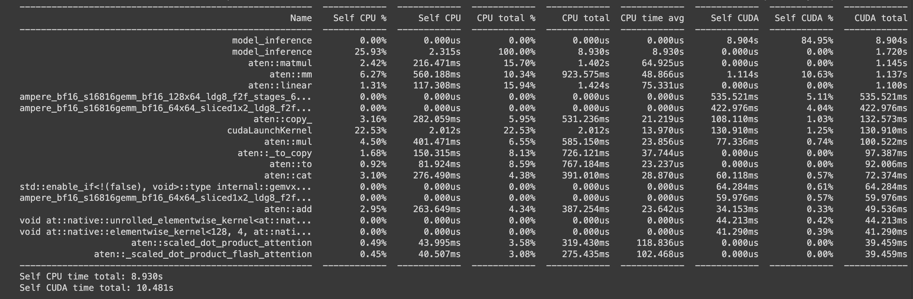
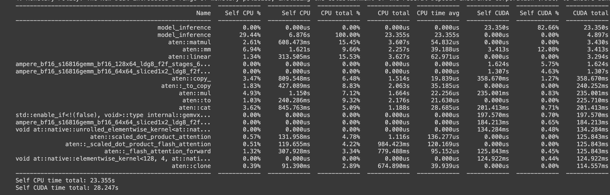
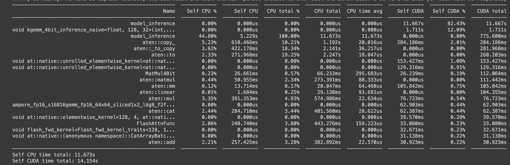
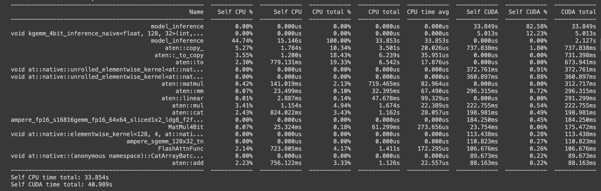

# LLaMA3_FlashAttention_-Quantization
Final project for NYU Tandon ECE-GY 9143 HPML

The gaol is to optimize the LLaMA 3 model through the integration of the Flash-Attention and quantization so that it can be run in local device with limited recource. 

## Project milestones

Research and Initial Setup --_COMPLETED_
- Choose LLaMA 3 8B-instruct Model.
- Read all the documentations of LLaMA, transformers, Flash Attention, PEFT (Parameter-Efficient Fine-Tuning)
- Set up the develpment Environment
   
Integration of Flash-Attention --_COMPLETED_
- Implemented Flash Attention within the LLaMA 3 model to improve processing speeds by reducing the computational overhead associated with traditional attention mechanisms.
- Tested the integration with basic examples to ensure compatibility and functional improvements.

Quantization Implementation --_COMPLETED_
- Applied 4-bit quantization to the LLaMA 3 model using the BitsAndBytes library to reduce memory requirements and enhance inference speed without significant loss of accuracy.
- Conducted preliminary tests to assess the impact of quantization on model performance and stability.

Evaluation and Benchmarking --_COMPLETED_
- Measured the inference time and training time improvements using the torch profiler.
- Compared performance metrics with and without Flash Attention and quantization to validate the effectiveness of these optimizations.
    
## Description of the repository and code structure

Since I don't have Nvidia GPU on my laptop, I used Google Colab for the Project. All the code and description is in the notebook.
-   `README.md`
	Project documentation
- `LLaMA_3_with_Flash_Attention_and_Quantization`
  The notebook contains all the code

	
## Example commands to execute the code

Open the Notebook via Google Colab or your local jupyter notebook if you have Nvidia GPU

1. Download the notebook from BERT/evaluate.ipynb 
2. Start the notebook server from the command line/terminal with command `jupyter notebook`
3. Run the notebook

## Results and observations

**Summary of Main Results**

Model Inference
The improvement using Flash attention 2 is not obvious for my two case input sequence length. In fact, it took longer to inference with Flash attention 2. However, according the report from Hugging Face, they concluded that Flash attention can achieve at most 1.9 speed up. I will conduct more study on that.

Model Fine Tuning
The improvement with Flash attention 2 is noticeable even with a small dataset and small epochs. The training time decrease from 20.67 to 19.57. A much better result compared to the model inference. Also, the usage of quantization with QLoRa is the most significant as it allows me to load the LLaMA 3 model into a L4 GPT which is unable to train the full precision LLaMA 3 in the first place. 

Without Flash Attention and 4 bits Quantization
- short input
reponse: Arrrr, shiver me timbers! Me name be Captain Chatbot, the scurviest chatbot to ever sail the Seven Seas! Me be a swashbucklin' bot, here to plunder yer questions and answer 'em with me trusty parrot on me shoulder! So hoist the colors, me hearty, and let's set sail fer a treasure trove o' knowledge!

- long input
Response: The New Deal helped the US economy in several ways:

1. Job Creation: The New Deal created millions of jobs through various programs, such as the Works Progress Administration (WPA), the Civilian Conservation Corps (CCC), and the Public Works Administration (PWA). This helped to reduce unemployment and stimulate economic growth.
2. Infrastructure Development: The New Deal invested heavily in infrastructure development, including the construction of roads, bridges, airports, and public buildings. This improved the country's transportation network, increased economic activity, and created jobs.
3. Social Welfare Programs: The New Deal introduced a range of social welfare programs, such as Social Security, unemployment insurance, and aid to families with dependent children. These programs provided financial assistance to those in need and helped to reduce poverty.
4. Monetary Policy: The New Deal introduced a range of monetary policies, including the establishment of the Federal Deposit Insurance Corporation (FDIC) to insure bank deposits, and the creation of the National

With Flash Attention and 4 bits Quantization
- short input
Response: Arrrr, me hearty! Me name be Captain Chatbot, the scurviest and most charmin' pirate chatbot to ever sail the Seven Seas! I be here to swab yer deck with me responses, and keep ye entertained with me witty banter and treasure trove of knowledge! So hoist the colors, me hearty, and let's set sail fer a swashbucklin' good time!

- long input
Response: During the Great Depression, President Franklin D. Roosevelt implemented a series of programs and projects known as the "New Deal." The New Deal was a series of policies and reforms aimed at helping Americans affected by the Great Depression, which lasted from 1929 to the late 1930s.

The New Deal was enacted through a series of executive orders, laws, and programs that aimed to:

1. Provide relief to those affected by the Depression, including the unemployed, the poor, and the elderly.
2. Stimulate economic recovery through infrastructure development, job creation, and economic stimulus.
3. Reform the financial system and regulate industries to prevent future crises.

Some notable programs and projects included in the New Deal are:

1. The Works Progress Administration (WPA): Provided jobs for millions of Americans, focusing on infrastructure development, construction, and artistic projects.
2. The Civilian Conservation Corps (CCC): Employed young men in conservation and infrastructure projects, such as building parks, roads, and conservation efforts.
3. The Federal Emergency Relief Administration (FERA): Provided direct financial assistance to states for relief efforts.
4. The Agricultural Adjustment Administration (AAA): Paid farmers to reduce crop production, aiming to raise agricultural prices.
5. The National Recovery Administration (NRA): Established

Fine tunine with QLoRA 

Fine tunine with QLoRA and Flash Attention

